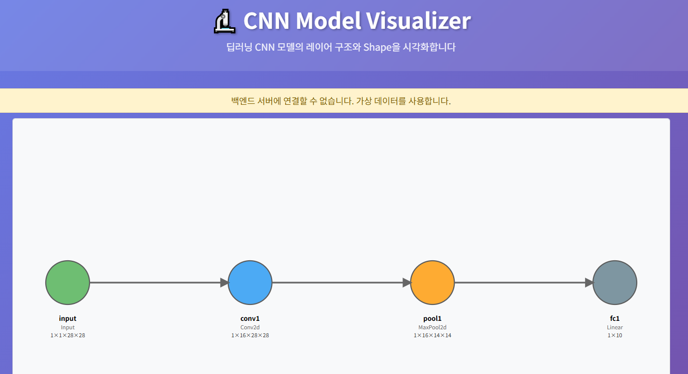
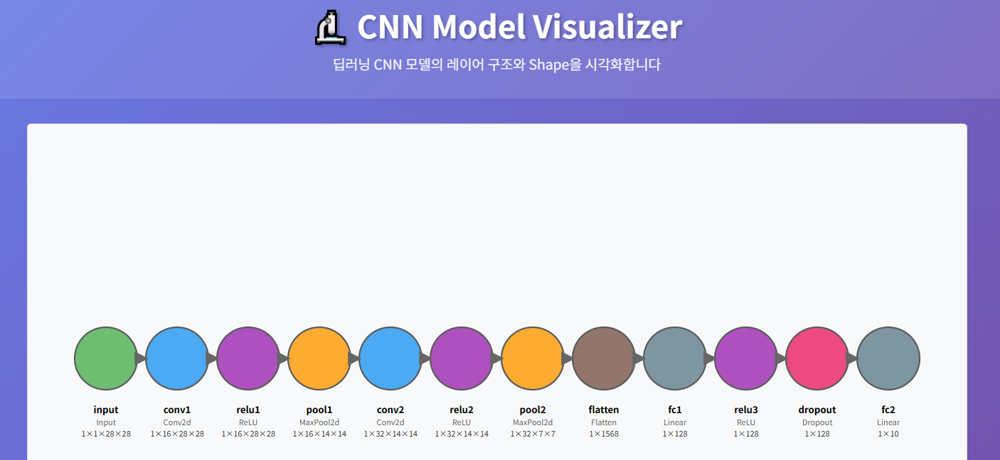

# 🔬 CNN Model Visualizer

딥러닝 CNN 모델의 레이어 구조와 Shape을 시각화하는 웹 애플리케이션입니다.

## ✨ 주요 기능

- **CNN 모델 시각화**: 각 레이어를 색상별로 구분하여 표시
- **Shape 정보**: 각 레이어의 출력 shape 정보 표시
- **인터랙티브**: 마우스 호버 시 상세 정보 툴팁 표시
- **반응형 디자인**: 다양한 화면 크기에 대응
- **에러 핸들링**: 백엔드 연결 실패 시 가상 데이터 사용
- **실시간 API 연동**: FastAPI 백엔드와 React 프론트엔드 연동

## 🖼️ 스크린샷

### 메인 CNN 시각화 화면


### 프론트엔드 상세 화면


## 🏗️ 프로젝트 구조

```
web_CNN_visualizer/
├── app.py                 # FastAPI 백엔드 서버 (포트 9000)
├── requirements.txt       # Python 의존성
├── frontend/             # React 프론트엔드 (포트 3000)
│   ├── src/
│   │   ├── App.js        # 메인 앱 컴포넌트
│   │   ├── App.css       # 스타일시트
│   │   └── ModelVisualizer.js  # CNN 시각화 컴포넌트
│   └── package.json      # Node.js 의존성
├── docs/                 # 프로젝트 문서 및 스크린샷
│   └── screenshots/      # 애플리케이션 스크린샷
├── .gitignore            # Git 제외 파일 설정
└── README.md             # 프로젝트 설명서
```

## 🚀 실행 방법

### 1. 백엔드 실행

```bash
# 의존성 설치
pip install -r requirements.txt

# 서버 실행 (포트 9000)
python app.py
```

또는

```bash
uvicorn app:app --reload --host 127.0.0.1 --port 9000
```

### 2. 프론트엔드 실행

```bash
cd frontend

# 의존성 설치
npm install

# 개발 서버 실행 (포트 3000)
npm start
```

## 🌐 접속 주소

- **프론트엔드**: http://localhost:3000
- **백엔드 API**: http://localhost:9000
- **API 문서**: http://localhost:9000/docs
- **모델 데이터**: http://localhost:9000/model/shapes

## 📊 CNN 모델 구조

현재 구현된 모델은 MNIST 데이터셋을 위한 간단한 CNN입니다:

1. **Input**: 28×28 MNIST 이미지
2. **Conv2d**: 16개 필터, 3×3 커널
3. **ReLU**: 활성화 함수
4. **MaxPool2d**: 2×2 풀링
5. **Conv2d**: 32개 필터
6. **ReLU**: 활성화 함수
7. **MaxPool2d**: 2×2 풀링
8. **Flatten**: 특성 맵 평탄화
9. **Linear**: 128개 뉴런
10. **ReLU**: 활성화 함수
11. **Dropout**: 과적합 방지
12. **Linear**: 10개 클래스 출력

## 🛠️ 기술 스택

- **백엔드**: FastAPI, Python 3.10+
- **프론트엔드**: React 19, D3.js 7
- **스타일링**: CSS3, 반응형 디자인
- **데이터 시각화**: D3.js
- **HTTP 클라이언트**: Axios
- **개발 서버**: Uvicorn, React Scripts

## 🔧 개발 환경 설정

### Python 환경
- Python 3.8+
- FastAPI 0.104+
- Uvicorn 0.24+

### Node.js 환경
- Node.js 16+
- npm 8+

## 📝 API 엔드포인트

- `GET /`: API 정보
- `GET /model/shapes`: CNN 모델 레이어 정보
- `GET /model/info`: 모델 전체 정보
- `GET /health`: 상태 확인

## 🎯 구현된 기능

### ✅ 완성된 기능
- [x] FastAPI 백엔드 서버
- [x] CNN 모델 데이터 API
- [x] React 프론트엔드
- [x] D3.js 기반 CNN 시각화
- [x] 레이어별 색상 구분
- [x] Shape 정보 표시
- [x] 인터랙티브 툴팁
- [x] 반응형 디자인
- [x] 에러 핸들링
- [x] CORS 설정

### 🔄 향후 계획
- [ ] 실제 PyTorch 모델 연동
- [ ] 레이어별 필터/커널 시각화
- [ ] 사용자 입력 기반 CNN 구조 생성
- [ ] 모델 성능 메트릭 표시
- [ ] 다양한 CNN 아키텍처 지원

## 🚨 문제 해결

### 포트 충돌 문제
- 기존 포트 8000 충돌 → 포트 9000으로 변경
- 프론트엔드 API 호출 URL도 함께 업데이트

### 백엔드 구조 개선
- 기존 복잡한 패키지 구조 → 단일 FastAPI 앱으로 단순화
- import 경로 문제 완전 해결

## 🤝 기여하기

1. 이 저장소를 포크합니다
2. 새로운 기능 브랜치를 생성합니다
3. 변경사항을 커밋합니다
4. Pull Request를 생성합니다

## 📄 라이선스

MIT License

---

**개발자**: 김창용  
**프로젝트**: CNN Model Visualizer  
**최종 업데이트**: 2025년 8월
